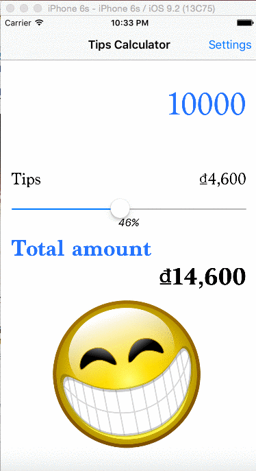
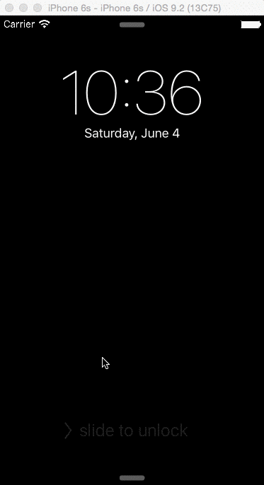

# TipsCalculator
Time spent: 10h 

Completed:

* [x] Required: User can enter a bill amount, choose a tip percentage, and see the tip and total values.
* [x] Required: Settings page to change the default tip percentage. I modify my settings page to have a default rate for each service (based the Vietnamese link you provided), It's not too hard to implement but it seems useful. When the display of currency, Vietnamese currency does not display like USD, EUR. The VND symbol displays in the end of money amount. USD, EUR, ... are displayed in the front.
* [x] Optional: UI animations
* [x] Optional: Remembering the bill amount across app restarts (if <10mins)
* [x] Optional: Using locale-specific currency and currency thousands separators.
* [x] Optional: Making sure the keyboard is always visible and the bill amount is always the first responder. This way the user doesn't have to tap anywhere to use this app. Just launch the app and start typing.
* [x] Optional: I don't apply the above optional implementation because I use Slider to update the rate. The Smiley icon makes my users more fun. The more tips the happier you are, but if the tips rate is zero, you are still smiley because you're professional and gentle.
* [x] Optional: Fix bug auto-layout for my emotion icon.

Story: 
I have another story for it! (and I also had one for previous TipsCalculator) Hope you still remembered I’m using Hackintosh for coding. Unfortunately it had “overheat” decease, now I know what hot fix is. Even I doubt that this submission is overdue, hope is free and I don’t want to waste a chance to get into amazing SELECT course. 

Walkthrough of all user stories:

GIF created with [LiceCap](http://www.cockos.com/licecap/).